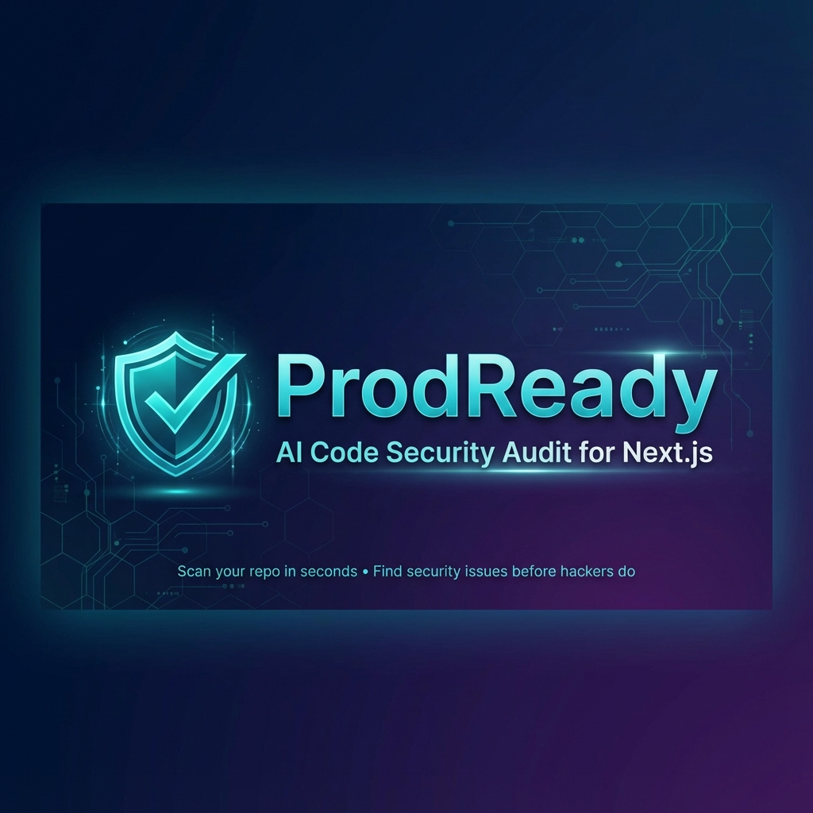

# 🛡️ ProdReady - Code Security & SEO Audit for AI Code

<div align="center">



**Your Copilot Writes. We Verify.**

[](https://opensource.org/licenses/MIT)
[](https://developer.mozilla.org/en-US/docs/Web/JavaScript)
[](https://www.typescriptlang.org/)

[Live Demo](https://prodready.dev) • [Documentation](#features) • [Contributing](#contributing) • [Report Bug](https://github.com/prodready/prodready/issues)

</div>

---
**The "Vibe Coder" Problem:**

AI coding assistants (Cursor, GitHub Copilot, ChatGPT, v0, Bolt) overwhelmingly generate code in **Next.js and React** because:
- 📊 **80%+ of AI-generated web apps** use Next.js or React
- 🤖 **LLM training data** is heavily weighted toward these frameworks
- 🚀 **"Vibe coders"** (developers who rely heavily on AI) primarily ship in this stack

**Our Mission:** Catch the security holes and SEO gaps that AI assistants create *before* you deploy.

While all JavaScript/TypeScript projects are supported, we've optimized our rules for the frameworks where AI makes the most mistakes. As AI coding expands to other languages, so will ProdReady.

## 🚀 So, What is ProdReady?

**ProdReady** is an open-source security, SEO, and code quality scanner for **JavaScript/TypeScript projects**. It performs **50+ automated checks** in seconds to catch issues that AI coding assistants often miss before you deploy to production.

**Optimized for Next.js** with full support for React, Vue, Node.js, and any JS/TS codebase.

### 🎯 Supported Languages & Frameworks

| Language/Framework | Support Level | Notes |
|-------------------|---------------|-------|
| **Next.js** | ✅ Full | Optimized with framework-specific checks |
| **React** | ✅ Full | Component-level security & accessibility |
| **TypeScript** | ✅ Full | Type safety checks, any detection |
| **JavaScript** | ✅ Full | ES6+, CommonJS, ESM |
| **Vue.js** | ⚠️ Partial | JS/TS checks work, framework checks planned |
| **Node.js** | ⚠️ Partial | Security checks work, API-specific checks planned |
| **Svelte** | ⚠️ Partial | Basic checks only |
| **Angular** | ⚠️ Partial | Basic checks only |
| **Python/Ruby/Go** | 🔜 Planned | Coming in future versions |


### 🔓 GitHub Repository Access

**Current Version (v1.0):**
- ✅ **Public repositories** - Full access, no authentication required
- ❌ **Private repositories** - Not supported yet

**Why?** The scanner uses GitHub's public API without authentication. This is perfect for open-source projects but can't access private repos.

**Coming Soon (Phase 3):**
- 🔜 GitHub OAuth integration
- 🔜 Personal access token support
- 🔜 Scan your private repositories securely
- 🔜 Team/organization repository access

**Workaround for Private Repos:**
1. Clone your repo locally
2. Run ProdReady locally (see [Local Setup](#option-2-run-locally))
3. Point scanner to local directory (feature coming soon)

### ⚠️ The Problem: AI Writes Fast, But Ships Vulnerabilities Faster

AI coding assistants (Cursor, GitHub Copilot, ChatGPT, v0, Bolt) are **revolutionizing development speed**, but they're also creating a new class of security and quality issues:

| What AI Does Wrong | Why It Matters | Real Impact |
|-------------------|----------------|-------------|
| 🔑 **Exposed API keys** | Hardcodes secrets in code | → Unauthorized access, $1000s in API bills |
| 🕳️ **Missing input validation** | Skips sanitization | → Injection attacks, data breaches |
| 🐛 **Debug code in production** | Leaves console.logs, test routes | → Exposes internal logic to attackers |
| 🔍 **No SEO metadata** | Forgets `<title>`, OG tags | → Invisible to Google, no social shares |
| 🔓 **Hardcoded secrets** | Commits `.env` values | → Scraped from public repos in minutes |
| ♿ **Poor accessibility** | Missing alt text, ARIA labels | → Excludes users, violates WCAG |
| 🎨 **Inline styles everywhere** | Hardcoded colors, magic numbers | → Unmaintainable, inconsistent UI |
| 🗑️ **Zombie code** | Unused imports, empty components | → Bloated bundles, slower load times |

**The "Vibe Coder" Reality:**
- ✅ AI writes your app in **hours** instead of weeks
- ❌ But ships with **security holes** you won't notice until it's too late
- 🚨 **68% of AI-generated code** has at least one security issue ([GitHub, 2024](https://github.blog))

**ProdReady is your safety net.** Scan before you ship, catch what AI missed, deploy with confidence.

---

## ✨ Features

### 🔒 Security Scanning (20+ Checks)
- **API Key Detection** - Finds exposed OpenAI, Stripe, AWS, and other API keys
- **Secret Scanning** - Detects hardcoded credentials and tokens
- **XSS Prevention** - Identifies dangerous `dangerouslySetInnerHTML` usage
- **.env File Protection** - Ensures environment files are gitignored
- **Input Validation** - Checks for missing form validation
- **External Link Safety** - Detects unsafe `target="_blank"` without `rel="noopener"`

### 🔍 SEO & Accessibility (15+ Checks)
- **Metadata Validation** - Ensures proper `<title>`, `<meta>` tags
- **OpenGraph Tags** - Verifies social media preview configuration
- **Image Alt Text** - Finds images missing accessibility attributes
- **Semantic HTML** - Detects div soup and missing semantic elements
- **robots.txt & sitemap.xml** - Checks for essential SEO files
- **Favicon Verification** - Ensures custom branding is in place

### 🧹 Code Hygiene (15+ Checks)
- **Console.log Detection** - Finds debug statements in production code
- **Unused Imports** - Identifies zombie imports bloating your bundle
- **TODO Comments** - Flags unfinished work before deployment
- **TypeScript Safety** - Detects dangerous `any` types
- **Hardcoded Values** - Finds hardcoded colors, URLs, and magic numbers
- **Empty Components** - Identifies components that return null

---

## 🎯 Why ProdReady?

| Feature | ESLint | IDE Tools | **ProdReady** |
|---------|--------|-----------|---------------|
| Security vulnerability detection | ⚠️ Partial | ⚠️ Partial | ✅ Full |
| SEO & accessibility checks | ❌ None | ❌ None | ✅ Full |
| Cross-file analysis | ⚠️ Partial | ⚠️ Partial | ✅ Full |
| Zero configuration | ❌ None | ⚠️ Partial | ✅ Full |
| Pre-launch checklist | ❌ None | ❌ None | ✅ Full |
| Actionable fix guides | ⚠️ Partial | ⚠️ Partial | ✅ Full |
| Works on any public repo | ❌ None | ❌ None | ✅ Full |

**ProdReady complements your existing tools** - it's not a replacement, it's your final check before shipping.

---

## 🚀 Quick Start

### Option 1: Use the Web App (No Installation)
1. Visit [prodready.dev](https://prodready.dev)
2. Paste your GitHub repository URL
3. Get your security report in 30 seconds

### Option 2: Run Locally

```bash
# Clone the repository
git clone https://github.com/prodready/prodready.git
cd prodready

# Install dependencies
npm install

# Set up environment variables
cp env.example.txt .env.local
# Add your Supabase credentials (optional for email capture)

# Run development server
npm run dev

# Open http://localhost:3000
```

### Option 3: Deploy Your Own Instance

[](https://vercel.com/new/clone?repository-url=https://github.com/prodready/prodready)

See [Deployment Guide](./DEPLOYMENT_GUIDE.md) for detailed instructions.

---

## 📖 How It Works

1. **Paste Repository URL** - Any public GitHub repository
2. **Instant Scan** - 50+ checks run automatically in 30 seconds
3. **Get Report** - See every issue with severity, location, and fix guide
4. **Fix Issues** - Copy AI-ready prompts for your coding assistant

### Example Output

```
🎯 Vibe Score: 81/100 (Grade B)
✅ 16 Checks Passed
❌ 3 Issues Found

🔴 CRITICAL: Exposed API Key
   File: src/lib/openai.ts:12
   Fix: Move to environment variable

🟡 MEDIUM: Missing Alt Text
   File: src/components/hero.tsx:45
   Fix: Add descriptive alt attribute

🟢 LOW: Console.log in Production
   File: src/app/page.tsx:89
   Fix: Remove or use proper logging
```

---

## 🛠️ Technology Stack

- **Framework:** Next.js 16 (App Router)
- **Language:** TypeScript 5
- **Styling:** Tailwind CSS 4
- **UI Components:** Radix UI
- **Database:** Supabase (PostgreSQL)
- **Deployment:** Vercel
- **Scanner Engine:** Custom AST analysis + GitHub API

---

## 📚 Documentation

### For Users
- [Getting Started Guide](./docs/getting-started.md)
- [Understanding Your Report](./docs/understanding-reports.md)
- [Vulnerability Guides](./src/data/inspection-rules.ts)
- [FAQ](./docs/faq.md)

### For Developers
- [Architecture Overview](./docs/architecture.md)
- [Scanner Engine](./src/lib/scanner/README.md)
- [Adding New Rules](./docs/adding-rules.md)
- [API Reference](./docs/api.md)

---

## 🤝 Contributing

We welcome contributions! ProdReady is open-source and community-driven.

### Ways to Contribute

1. **Add New Security Rules** - Help us detect more vulnerabilities
2. **Improve Fix Guides** - Make our recommendations more actionable
3. **Report Bugs** - Found an issue? [Open an issue](https://github.com/prodready/prodready/issues)
4. **Improve Documentation** - Help others understand ProdReady
5. **Spread the Word** - Star the repo, share on Twitter

### Development Setup

```bash
# Fork and clone the repository
git clone https://github.com/YOUR_USERNAME/prodready.git

# Install dependencies
npm install

# Create a branch
git checkout -b feature/your-feature-name

# Make your changes and test
npm run dev
npm run build

# Submit a pull request
```

See [CONTRIBUTING.md](./CONTRIBUTING.md) for detailed guidelines.

---

## 🎯 Use Cases

### For Solo Developers
- ✅ Catch security issues before deployment
- ✅ Ensure SEO best practices
- ✅ Clean up AI-generated code

### For Teams
- ✅ Pre-deployment checklist in CI/CD
- ✅ Code review automation
- ✅ Onboarding new developers

### For Agencies
- ✅ Client project audits
- ✅ Quality assurance
- ✅ Competitive analysis

---

## 📊 Roadmap

### ✅ Phase 1: Core Scanner (Complete)
- [x] 50+ security, SEO, and hygiene checks
- [x] GitHub integration
- [x] Real-time scanning
- [x] Detailed reports with fix guides

### 🚧 Phase 2: Auto-Fix (In Progress)
- [ ] One-click AI-powered fixes
- [ ] Pull request generation
- [ ] Batch issue resolution

### 📅 Phase 3: CI/CD Integration (Planned)
- [ ] **GitHub OAuth** - Scan private repositories
- [ ] **Personal Access Tokens** - Secure authentication
- [ ] GitHub Actions integration
- [ ] GitLab CI support
- [ ] Slack/Discord notifications
- [ ] API for custom integrations

### 🔮 Phase 4: Multi-Language Support (Future)
- [ ] Python support (Django, Flask)
- [ ] Ruby support (Rails)
- [ ] Go support
- [ ] PHP support (Laravel)
- [ ] Java/Kotlin support

### 🌟 Phase 5: Advanced Features (Future)
- [ ] Custom rule creation
- [ ] Team collaboration
- [ ] Historical tracking
- [ ] Performance benchmarking

[Vote for which feature you want next →](https://prodready.dev/#vote)

---

## 🌟 Why Open Source?

We believe security and code quality tools should be:
- **Transparent** - You can see exactly what we check
- **Trustworthy** - No black box algorithms
- **Customizable** - Add your own rules
- **Free** - No paywalls for basic security

**ProdReady will always be free and open-source.**

---

## 📄 License

ProdReady is [MIT licensed](./LICENSE).

---

## 🙏 Acknowledgments

Built with:
- [Next.js](https://nextjs.org/) - React framework
- [Tailwind CSS](https://tailwindcss.com/) - Styling
- [Radix UI](https://www.radix-ui.com/) - UI components
- [Supabase](https://supabase.com/) - Database
- [Vercel](https://vercel.com/) - Hosting
---

## 🚀 Get Started

Ready to ship production-ready code?

1. **Try it now:** [prodready.dev](https://prodready.dev)
2. **Star the repo:** Help others discover ProdReady
3. **Share feedback:** [Open an issue](https://github.com/prodready/prodready/issues)

---

<div align="center">

**Made with ❤️ by product manager, for developers and vibecoders**

[Website](https://prodready.dev) • [GitHub](https://github.com/prodready/prodready) • [Twitter](https://twitter.com/prodready)

</div>
